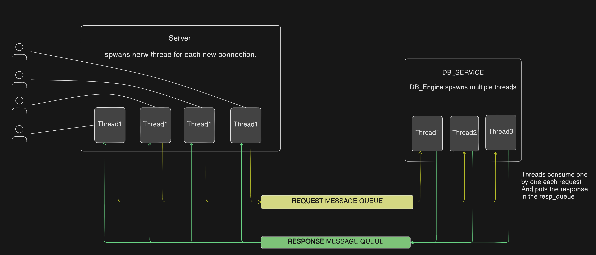
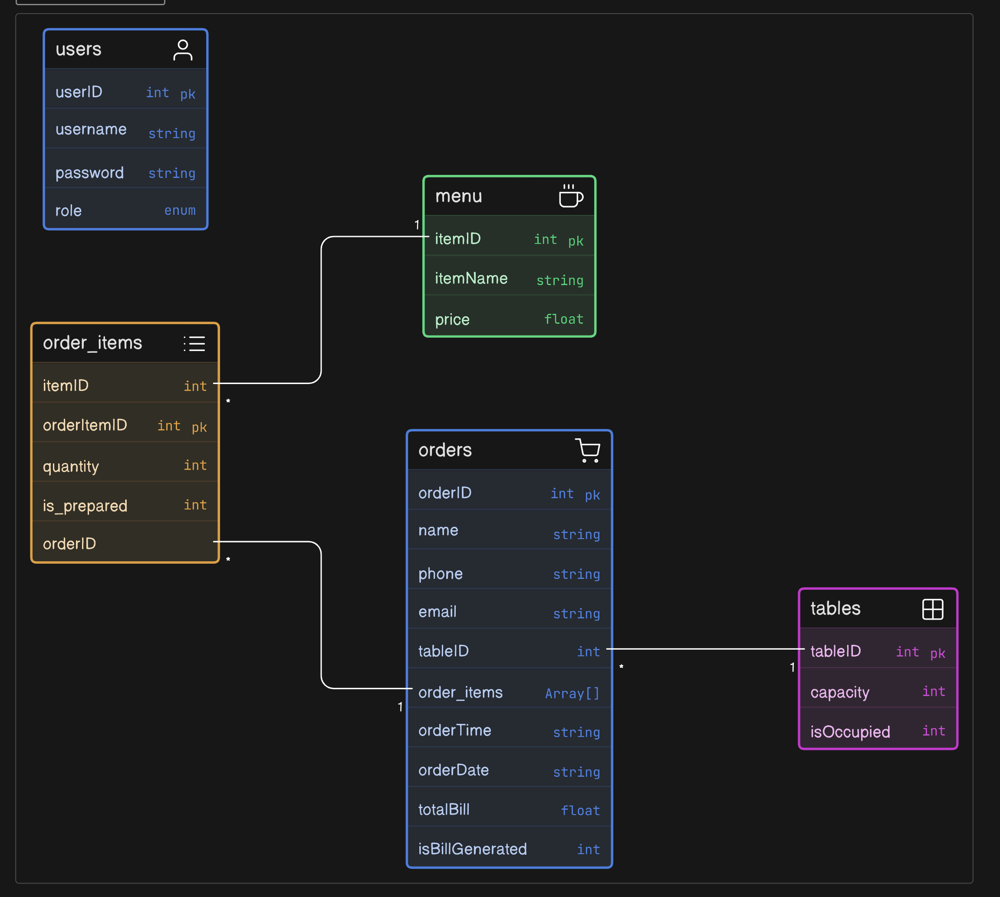

# 🍽️ Restaurant Management System (OS Lab Project)

## 📌 Overview
This project is a **multi-user Restaurant Management System** built to demonstrate core **Operating Systems concepts** through a practical implementation.

The system follows a **client-server architecture**, supporting multiple roles such as **Admin, Chef, and Customer**, with real-time interaction and concurrency handling.

---

## 🚀 Features

- 👤 **Role-Based Access Control**
  - Admin: Manage menu and tables
  - Chef: Update order status
  - Customer: Place and track orders

- 🌐 **Client-Server Communication**
  - TCP socket-based communication
  - Multiple clients handled simultaneously

- ⚙️ **Concurrency Handling**
  - Multi-threaded server
  - Mutex-based synchronization

- 🔁 **Inter-Process Communication (IPC)**
  - System V Message Queues
  - Server ↔ Database service communication

- 🧠 **Data Consistency**
  - Prevents race conditions and lost updates
  - Controlled access to shared resources

---

## 🏗️ System Architecture



---

## 🧩 ER Diagram



---

## 🧪 OS Concepts Implemented

| Concept                  | Implementation |
|-------------------------|---------------|
| Role-Based Authorization | Access control based on user roles |
| Socket Programming       | TCP client-server model |
| Concurrency Control      | Threads + Mutex locks |
| IPC                      | Message Queues |
| Data Consistency         | Synchronization mechanisms |
| File Handling            | Structured data storage |

---

## 🛠️ Tech Stack

- **Language:** C  
- **Concurrency:** POSIX Threads  
- **Communication:** TCP Sockets  
- **IPC:** System V Message Queues  
- **Synchronization:** Mutex Locks  

---


---

## ⚙️ How to Run

### 1. Compile
```bash
make all
```

### 2. Run Components (in separate terminals)

```bash
make run   --> this runs the Db service and server
make run_client    --> this runs client
```

---

## ⚠️ Challenges Faced

- Managing thread synchronization correctly
- Designing IPC between server and database
- Avoiding race conditions in shared data

---
